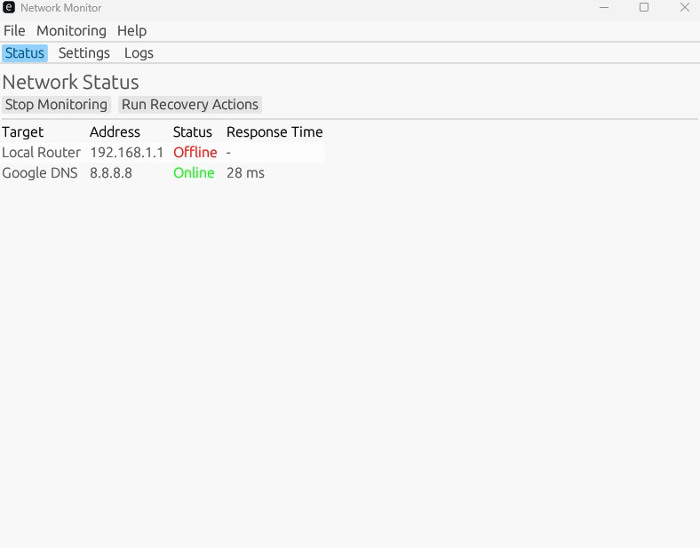

index.html 에서 

1. 이메일주소 옆에에 사이드 프로젝트 보러 가기 버튼을 추가
2. 버튼을 선택 시 사이드 프로젝트 목록페이지로로 이동 (모든 이동페이지에는 이전으로 이동하기 버튼이 추가되어 있어야 함)
3. 이동된 페이지에서 2025년 5월의 사이드 프로젝트입니다. 라는 소개 페이지를 추가
4. 6개의 페이지를 이동할 수 있는 버튼 선택

***6개의 프로젝트***
## 각 페이지의 README.md를 참고하여 소개 페이지를 한글로로 생성 

1. https://github.com/jinyounghwa/SubBill

- 소개페이지에 활용할 이미지 

2. https://github.com/jinyounghwa/URLReportGenerator

- 소개페이지에 활용할 이미지 

3. https://github.com/jinyounghwa/job_site_scraper

- 소개페이지에 활용할 이미지 

4. https://github.com/jinyounghwa/URLABtest

- 소개페이지에 활용할 이미지 

5. https://github.com/jinyounghwa/sideproject

- 소개페이지에 활용할 이미지 

6. https://github.com/jinyounghwa/Rust_Project01

- 소개페이지에 활용할 이미지 
